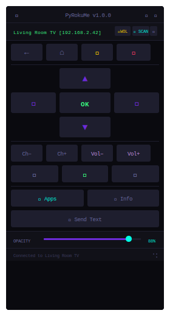

<div align="center">



# PyRokuMe

**A compact, keyboard-driven Roku remote for Windows — no browser, no Electron, just Python.**

[](https://github.com/reaprrr/PyRokuMe/releases)
[](https://www.python.org/)
[](https://github.com/reaprrr/PyRokuMe)
[](LICENSE)

</div>

---

## What is it?

PyRokuMe is a single-file Python remote control for Roku devices. It auto-discovers Rokus on your network, presents a full button layout in a compact resizable window, and gets out of your way. It uses Roku's built-in [ECP (External Control Protocol)](https://developer.roku.com/docs/developer-program/debugging/external-control-api.md) over HTTP — no Roku account, no cloud, no tracking.

---

## Features

- **Auto-discovery** — finds Roku devices via SSDP multicast and a parallel IP range scan simultaneously; manual IP entry as fallback
- **Full remote layout** — Back, Home, Mute, Power, D-pad, OK, Vol±, Ch±, Rewind, Play/Pause, FF
- **Keyboard shortcuts** — full keyboard mapping so you never have to click (controku-compatible, fully remappable)
- **App launcher** — browse and launch installed channels directly from the remote
- **Send text** — type text and send it character-by-character to your Roku via ECP
- **Wake on LAN** — send a magic packet to wake your Roku or TV from sleep
- **Multi-device** — save and quick-switch between multiple Rokus from the device bar
- **6 colour themes** — Dark, Terminal, Ice, Sunset, Midnight, Light — switch live with no restart
- **Opacity control** — slide the window transparency from 20% to 100%
- **Always on top** — optional pin to keep the remote above other windows
- **Auto-reconnect** — silently re-establishes connection if the Roku goes to sleep and wakes
- **Portable mode** — run from a folder named `PyRokuMe` and all config stays next to the script
- **Resize from corner** — drag the bottom-right grip to resize; drag the title bar to move

---

## Requirements

- Windows 10 or 11
- Python 3.8+
- `requests` (auto-installed on first launch if missing)

All other dependencies (`tkinter`, `socket`, `threading`, `ctypes`, etc.) are part of the Python standard library.

---

## Installation

### Quick start

```bash
git clone https://github.com/reaprrr/PyRokuMe.git
cd PyRokuMe
python PyRokuMe.pyw
```

On first launch, PyRokuMe will check for `requests` and offer to install it automatically.

### Manual dependency install

```bash
pip install requests
```

### Portable mode

Place `PyRokuMe.pyw` inside a folder named exactly `PyRokuMe` and run it from there. Config and settings will be saved alongside the script instead of in `%APPDATA%`, making the whole thing USB-stick portable.

```
PyRokuMe/
├── PyRokuMe.pyw   ← script detects the folder name and goes portable
└── config.json    ← auto-created on first run
```

### Standard mode

Run from anywhere else and config is saved to `%APPDATA%\PyRokuMe\config.json`.

---

## Keyboard Shortcuts

| Key(s) | Action |
|---|---|
| `W` / `↑` | Up |
| `S` / `↓` | Down |
| `A` / `←` | Left |
| `D` / `→` | Right |
| `Enter` / `Space` / `O` | OK / Select |
| `Backspace` / `B` | Back |
| `Escape` / `H` | Home |
| `I` | Info |
| `,` / `R` | Rewind |
| `.` / `F` | Fast Forward |
| `/` / `P` | Play / Pause |
| `[` / `-` | Volume Down |
| `]` / `+` | Volume Up |
| `\` / `M` | Mute |

All bindings are remappable from the **Keybinds** panel inside the app.

---

## Themes

| Name | Description |
|---|---|
| **Dark** *(default)* | Deep navy background, cyan accent |
| **Terminal** | GitHub-dark palette, blue accent |
| **Ice** | Cold deep-blue tones, sky accent |
| **Sunset** | Warm dark reds, orange accent |
| **Midnight** | Deep indigo, purple/magenta accent |
| **Light** | White background for bright environments |

Switch themes from the 🎨 button in the title bar. Changes apply instantly.

---

## How it works

PyRokuMe communicates with your Roku using its built-in **External Control Protocol (ECP)** — a simple HTTP API that every Roku device exposes on port `8060`. No pairing, no authentication.

Discovery uses two methods simultaneously:
1. **SSDP** — sends a multicast probe to `239.255.255.250:1900` and listens for Roku responses
2. **TCP scan** — probes `192.168.2.1` through `192.168.2.99` in parallel threads, checking if port `8060` is open

Whichever finds your Roku first wins. Both run at the same time for speed.

---

## File structure

```
PyRokuMe/
├── PyRokuMe.pyw      # entire application — single file, no build step
├── config.json       # auto-created: saved device, theme, position, keybinds
├── requirements.txt  # pip dependencies (requests only)
├── LICENSE
└── README.md
```

---

## Contributing

Pull requests are welcome. For significant changes, please open an issue first to discuss what you'd like to change.

If you find a Roku ECP command that isn't exposed yet, the relevant section is `_ECP_ACTIONS` near the top of the script.

---

## License

MIT — see [LICENSE](LICENSE) for details.

---

<div align="center">
<sub>Built with Python + tkinter · Styled after <a href="https://github.com/reaprrr/PyDisplay">PyDisplay</a></sub>
</div>
